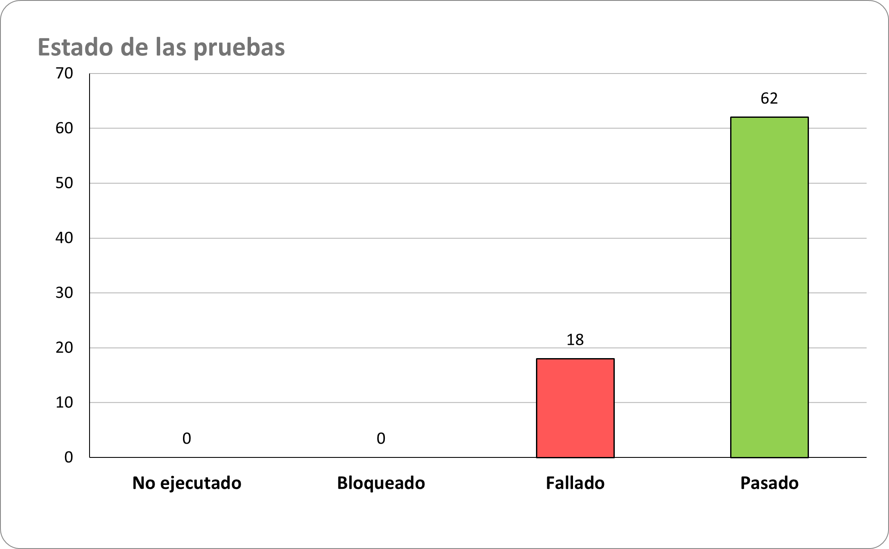
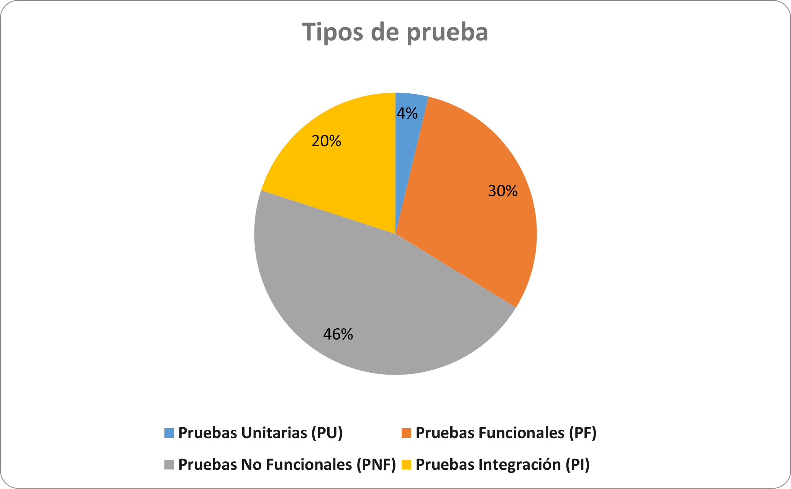
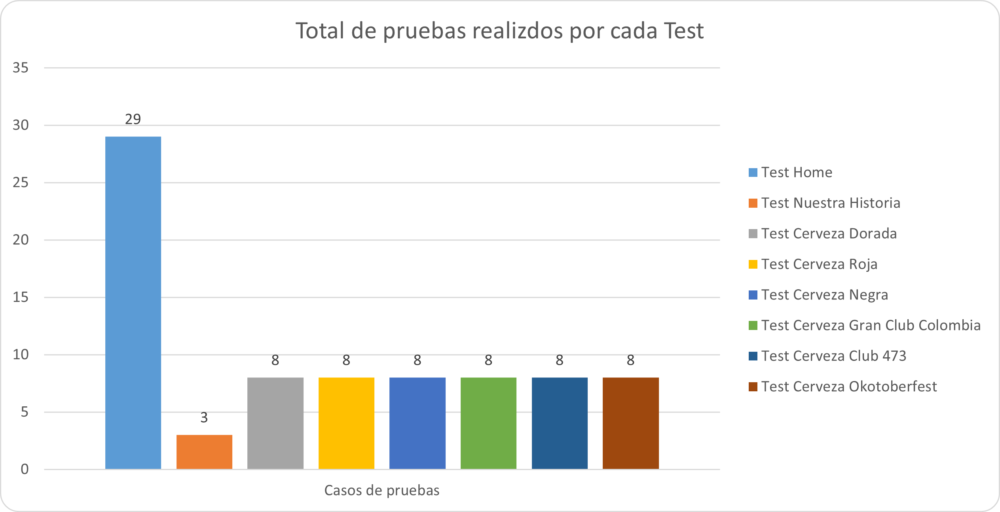

## Entregables

1. Diseño de Casos de Prueba.
2. [Automatización de pruebas.](Automatizacion/)

## 1. Diseño de Casos de Prueba.

Esta es una breve [explicación del diseño de prueba.](https://youtu.be/gl-1hGKYGEg)

El diseño del caso de prueba realizado muestra el estado de ejecución actual de cada tipo de prueba y el número total de casos de prueba diseñados para cada funcionalidad del sistema. Aquí está el resumen:

## Resultado de las pruebas:
- No Ejecutado: 0 casos de prueba.
- Bloqueado: 0 casos de prueba.
- Fallado: 18 casos de prueba.
- Pasado: 62 casos de prueba.

## Desglose por tipo de pruebas y porcentajes:
- Pruebas Unitarias (PU): 3 casos de prueba (4%).
- Pruebas Funcionales (PF): 24 casos de prueba (30%).
- Pruebas No Funcionales (PNF): 37 casos de prueba (46%).
- Pruebas Integración (PI): 16 casos de prueba (20%).

## Desglose por funcionalidad:
- Test Home: 29 pruebas.
- Test Nuestra Historia: 3 pruebas.
- Test Cerveza Dorada: 8 pruebas.
- Test Cerveza Roja: 8 pruebas.
- Test Cerveza Negra: 8 pruebas.
- Test Cerveza Gran Club Colombia: 8 pruebas.
- Test Cerveza Club 473: 8 pruebas.
- Test Cerveza Okotoberfest: 8 pruebas.

## Total de casos de prueba: 21.
- Total de pruebas: 80 

## Conclusión:

A pesar de que la mayoría de los casos de prueba han pasado con éxito, la presencia de 18 casos de prueba fallidos indica áreas críticas que necesitan una atención inmediata.
Se recomienda priorizar la resolución de los casos de prueba fallidos y aumentar la cobertura de pruebas, especialmente en las áreas con menor cantidad de casos de prueba diseñados.
Este análisis proporciona una base sólida para la mejora continua del proceso de prueba y garantiza la calidad y confiabilidad del sistema en desarrollo.

## 5. [Automatización de pruebas.](Automatizacion/)
    
Se ha creado un script de automatización que sigue el flujo normal de un usuario revisando la página web.

Para llevar a cabo estas acciones, se ha utilizado Selenium WebDriver en conjunto con Python. Se ha estructurado el código en clases y métodos para una mejor organización y reutilización del código. Además, se han creado casos de prueba que validan el comportamiento esperado de las funciones implementadas.

El script de automatización se ejecuta en un navegador Chrome.

## Estándares que se aplicaron en la prueba técnica.

En esta prueba técnica, se aplicaron varios estándares y metodologías recomendadas por el ISTQB (International Software Testing Qualifications Board) para el diseño y ejecución de pruebas de software. Algunos de los estándares y metodologías aplicados incluyen:

- ISTQB Syllabus: Se siguieron los lineamientos y contenidos definidos en el Syllabus del ISTQB para asegurar una cobertura adecuada de los diferentes tipos de pruebas, como pruebas unitarias, funcionales, no funcionales e integración.

- ISTQB Agile Tester: Se adoptaron prácticas ágiles para el diseño y ejecución de las pruebas, lo que incluye la integración continua, la entrega continua y la adaptabilidad a los cambios en los requisitos y el desarrollo del software.

- ISO/IEC 25010 (SQuaRE): Se consideraron los criterios de calidad definidos en la norma ISO/IEC 25010 para asegurar que los casos de prueba cubrieran aspectos importantes de calidad del software, como funcionalidad, usabilidad, eficiencia y mantenibilidad.

- ISTQB Test Design Techniques: Se utilizaron técnicas de diseño de pruebas recomendadas por el ISTQB para identificar escenarios de prueba relevantes, incluyendo técnicas como la partición de equivalencia, el análisis de valores límite y el diseño de casos de uso.

- ISTQB Test Management: Se aplicaron principios de gestión de pruebas recomendados por el ISTQB para planificar, diseñar, ejecutar y monitorear el proceso de pruebas, lo que incluye la asignación de recursos, la elaboración de informes y la gestión de riesgos.

En resumen, en esta prueba técnica se aplicaron estándares y metodologías reconocidas internacionalmente por el ISTQB para garantizar la calidad y eficacia del proceso de pruebas de software.